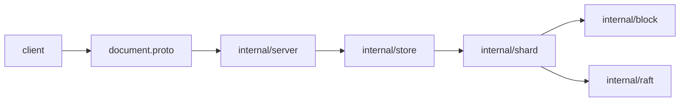
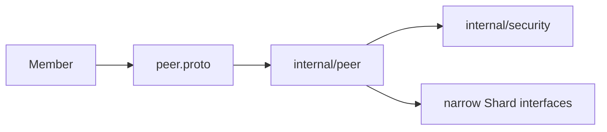
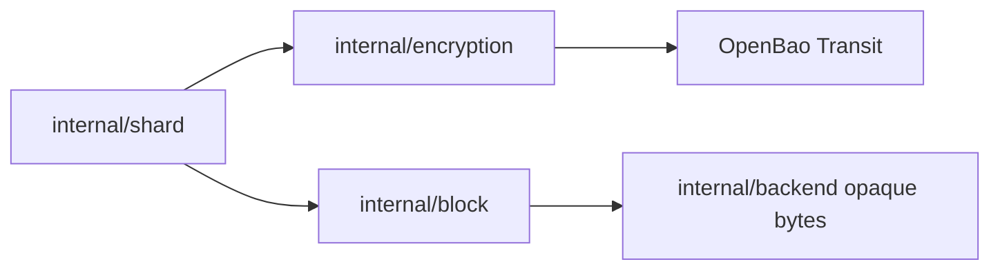
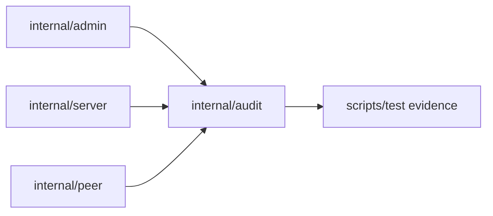

---
stepsCompleted:
  - 1
  - 2
  - 3
  - 4
  - 5
  - 6
  - 7
  - 8
inputDocuments:
  - CONTEXT.md
  - _bmad-output/project-context.md
  - _bmad-output/planning-artifacts/epics.md
  - _bmad-output/planning-artifacts/prds/prd-scrap-2026-06-07/prd.md
  - _bmad-output/planning-artifacts/prds/prd-scrap-2026-06-07/.decision-log.md
  - _bmad-output/planning-artifacts/prds/prd-scrap-2026-06-07/review-rubric.md
  - docs/agents/domain.md
  - docs/agents/issue-tracker.md
  - docs/agents/triage-labels.md
  - docs/adr/0001-bytes-separate-from-raft.md
  - docs/adr/0002-dual-checksum-architecture.md
  - docs/adr/0003-mirror-block-layout.md
  - docs/adr/0004-lean-pebble-with-metadata-tiering.md
  - docs/adr/0005-phase-1-spike-store-contract-boundary.md
  - docs/adr/0006-build-system-and-ci-structure.md
  - docs/adr/0007-custom-ulid-implementation.md
  - docs/adr/0008-async-content-scanning-architecture.md
  - docs/adr/0009-backend-object-key-format.md
  - docs/adr/0010-upload-outbox-via-raft.md
  - docs/adr/0011-pebble-projection-key-prefixes.md
  - docs/adr/0012-otel-evidence-plane.md
  - docs/adr/0013-trace-context-in-raft-log.md
  - docs/adr/0014-projection-resolution-boundary.md
  - docs/adr/0015-prodlike-kind-cell-cilium-and-gates.md
  - docs/adr/0016-phase-4-partial-eviction-boundary.md
  - docs/adr/0017-local-block-lifecycle-module.md
  - docs/adr/0018-eviction-campaign-module.md
  - docs/adr/0019-production-security-boundary.md
  - docs/adr/0020-openbao-envelope-encryption-contract.md
  - docs/go-style-guide.md
  - docs/archive/obsolete-pre-bmad/handoff-projection-resolver-review-20260529.md
  - docs/archive/obsolete-pre-bmad/phase-4-eviction-implementation-slices.md
  - docs/archive/obsolete-pre-bmad/phase-4.5-security-implementation-slices.md
  - docs/prd-closure-policy.md
  - docs/research/2026-05-31-external-storage-systems.md
  - docs/scrap-handoff-telemetry-phantom-metrics-implementation.md
workflowType: 'architecture'
project_name: 'scrap'
user_name: 'Coto'
date: '2026-06-08'
lastStep: 8
status: 'complete'
completedAt: '2026-06-08'
---

# Architecture Decision Document

_This document builds collaboratively through step-by-step discovery. Sections are appended as we work through each architectural decision together._

## Project Context Analysis

### Requirements Overview

Phase 4.5 is the security control-plane bridge that makes current hot-path operations governable without pretending Phase 5 cold-only reads exist yet.

Phase map:

`Phase 4 partial local eviction -> Phase 4.5 security control-plane bridge -> Phase 5 cold-only reads`

Before Phase 5 cold-only reads, operators need proof that storage access, peer trust, encryption, and auditability cannot be bypassed.

#### Phase 4.5 Is / Is Not

| Is | Is Not |
| --- | --- |
| Production security mode, startup gates, mTLS, role authorization, peer identity, audit, rate limits, Transit envelope encryption, rewrap, and prod-like evidence. | Phase 5 cold-only read functionality, S3 compatibility, new storage truth, Backend inventory authority, direct Backend ciphertext streaming, or new Document-byte paths. |

Phase 4.5 does not implement cold-only read success. It proves that any future cold read must pass storage authority, peer trust, encryption, and audit evidence controls.

#### Functional Requirements

The Phase 4.5 PRD defines 8 functional requirements across 3 epics and 10 stories.

| FR | Outcome | Epic | GitHub issue | Status | Evidence focus |
| --- | --- | --- | --- | --- | --- |
| FR-1 | Operator can start a Cell only in a valid security mode. | Production Security Boundary | #401 | Pending implementation | Startup fail-closed security mode checks |
| FR-2 | Public, peer, admin, and `scrapctl` surfaces can prove mTLS identity. | Production Security Boundary | #402 | Pending implementation | Per-surface mTLS credential validation |
| FR-3 | Caller can be authorized or denied before side effects. | Production Security Boundary | #403 | Pending implementation | Role authorization and Cell/Member identity checks |
| FR-4 | Auditor can review bounded security decisions and rate-limit outcomes. | Production Security Boundary | #404 | Pending implementation | Audit events and independent rate limits |
| FR-5 | Maintainer can test Transit behavior with a fake without changing storage truth. | Transit-Encrypted Document Lifecycle | #405 | Pending implementation | Transit client and deterministic fake behavior |
| FR-6 | Authorized writes/read paths encrypt and decrypt Document payloads while preserving integrity semantics. | Transit-Encrypted Document Lifecycle | #406 | Pending implementation | Encrypted writes and decrypted reads |
| FR-7 | Operator can rewrap envelope metadata durably without rewriting Block payload bytes. | Transit-Encrypted Document Lifecycle | #407 | Pending implementation | Durable, idempotent rewrap through Raft metadata |
| FR-8 | Operator can prove Phase 4.5 behavior before Phase 5 begins. | Production Readiness Evidence and Release Gates | #408 | Evidence needed | Prod-like proof for Phase 4.5 closure |

ADR 0019 and ADR 0020 are accepted architectural decisions. Issues #399 and #400 remain open as implementation/evidence reconciliation items, not unresolved architecture decisions.

#### Non-Functional Requirements

- Production security and encryption paths fail closed.
- Public, peer, admin, and `scrapctl` surfaces require separate authentication, authorization, audit, rate-limit, and exposure handling.
- Evidence must be reviewable: commit SHA, environment, command, timestamp, expected result, actual result, artifact path, and redaction proof.
- Logs, metrics, traces, fixtures, audit records, evidence bundles, screenshots, panic paths, and fake Transit state must not leak secrets, Document bytes, raw Document identifiers, plaintext data keys, or wrapped-key ciphertext.
- CRC verifies stored ciphertext Frame bytes; SHA-256 verifies plaintext Document bytes before return.
- Raft remains metadata authority. Pebble Projection remains derived. Transit provides cryptographic operations, not storage truth. Audit/OTel evidence proves behavior but is not authority.
- Fail-closed outcomes must be observable: denied reads, denied mutations, withheld credentials, no plaintext fallback, no raw identifier fallback, and audit events emitted without leaking secrets.
- Operator-facing outputs must be actionable: admin health, `scrapctl status`, and evidence bundles should show pass/fail, affected guarantee, reason, and next human action without requiring log spelunking.

#### Scale & Complexity

- Primary domain: backend storage gateway, security control plane, envelope encryption, operator evidence.
- Complexity level: enterprise infrastructure.
- Estimated architectural components: 12.
- Key components: `SecurityMode` config validator, TLS config builder, identity extractor, authz evaluator, audit sink, rate limiter/interceptor, `TransitClient` plus fake, envelope metadata codec, encrypted write/read integration, rewrap workflow, prod-like evidence harness, closure traceability map.

### Technical Constraints & Dependencies

S.C.R.A.P. is a gRPC Document gateway, not an S3-compatible API. Document identity is `(transaction_id, document_name)`; `tenant_id` is not storage identity. Document bytes and Block payload bytes do not go into Raft. OpenBao Transit is the encryption substrate. OpenTelemetry is the application telemetry producer contract.

#### Authority vs Derivation

| Concern | Authority / role |
| --- | --- |
| Raft | Owns metadata truth, policy state, and lifecycle decisions. |
| Pebble Projection | Derived and rebuildable; never production storage truth. |
| Transit | Owns cryptographic operations only; never storage truth. |
| Audit/OTel evidence | Proves behavior; never decides state. |
| Backend | Stores confirmed Block objects; Backend listing is not a consistency oracle. |

#### Package Ownership

| Package / surface | Owns | Must not own |
| --- | --- | --- |
| `internal/cmd` | Composition of config, TLS, identity, authz, audit, rate limits, Transit/fake wiring. | Storage behavior or protocol semantics. |
| `internal/server` | Public gRPC boundary, request validation, interceptors, central Store/gRPC error mapping. | Shard authority, Block layout, or crypto policy internals. |
| `internal/peer` | Peer transport security and peer RPC boundary. | Storage encryption policy or Shard internals. |
| `internal/shard` | Shard orchestration and authority adapters: Raft apply, leader/read gates, Block paths, Openlog, upload, eviction, restore, scrub coordination, Store error mapping, and side effects. | Transport-specific status mapping. |
| `internal/index` | Pebble Projection and Projection Resolution. | Authentication, authorization, audit, or crypto policy. |
| `internal/block` | Block/Frame encoding and `.blk`/`.idx` layout, including envelope persistence shape where the storage format requires it. | Transit calls or authorization decisions. |
| `internal/localblock` | Local Block Lifecycle markers, classification, and filesystem transitions. | Document visibility, durable upload authority, or read availability policy. |
| `internal/backend` | Backend abstraction and provider adapters over opaque bytes. | Envelope parsing, storage authority, or consistency decisions from Backend inventory. |

### Cross-Cutting Concerns Identified

- Phase boundary discipline: Phase 4.5 must not drift into Phase 5 cold-only reads.
- Fail-closed startup, TLS, identity, authz, Transit, audit sink, and rate-limit behavior.
- Recovery during encryption, rewrap, replayed writes, stale key versions, and partial envelope metadata.
- Negative tests for expired certificates, spoofed identity, deny-by-default authz, corrupted ciphertext CRC, plaintext SHA mismatch, missing envelope metadata, Transit timeout, Transit permission denied, interrupted rewrap, and attempted encrypted reads under the wrong security mode.
- Stakeholder needs:
  - Operators need enforceable secure mode, TLS identity, audit, rate limits, and prod-like evidence.
  - Billing users need authorization boundaries and encrypted Document payload guarantees.
  - Developers need fake Transit, clear config validation, and testable failure modes.
  - Security reviewers need current evidence bundles proving policy enforcement and redaction.
- Non-goals remain out of Phase 4.5 unless explicitly reprioritized: Phase 5 cold-read shape, metadata encryption, tenant-specific key policy, direct Backend ciphertext streaming, and transparent migration for existing unencrypted Blocks.
- Evidence bundles must be review artifacts, not raw log dumps. Each bundle should carry a manifest with policy state, TLS state, audit coverage, redaction proof, encryption path exercised, failure modes tested, timestamp, build/commit, and known gaps.
- Audit records should support reconstruction: who attempted what, against which Document/Transaction/Block boundary, with what authorization result, and whether sensitive payloads stayed redacted.

#### Future Agent Checklist

- Preserve the Phase 4.5 security control-plane scope; do not implement Phase 5 cold-only read behavior here.
- Keep Raft as metadata authority and Pebble Projection, Transit, Backend, audit, and OTel evidence in their non-authoritative roles.
- Put each capability in its owning package; do not let authz, audit, crypto, Backend, or Projection Resolution responsibilities bleed across boundaries.
- Tie every closure claim to FR, story, GitHub issue, command, commit/ref, artifact, negative test, and redaction proof.
- Use exact `CONTEXT.md` glossary terms: Document, Transaction, Block, Frame, Shard, Cell, Member, Backend, Pebble Projection, Projection Resolution.

## Starter Template Evaluation

### Primary Technology Domain

Existing Go backend/storage gateway.

S.C.R.A.P. V2 is already initialized as a Go module and has accepted architectural constraints, package boundaries, tooling, generated-code workflow, deployment shape, and evidence gates. A greenfield starter template would add more risk than value because it could overwrite or dilute existing domain boundaries.

### Technical Preferences Found

- Language/runtime: Go `1.26.4`, verified locally with `go version`.
- Module: `github.com/petabytecl/scrap`.
- API/wire format: gRPC + protobuf with Buf v2 config.
- Core storage/consensus: etcd Raft `v3.6.0`, Pebble `v1.1.5`.
- Telemetry: OpenTelemetry Go API/SDK `v1.44.0`, `otelgrpc v0.69.0`.
- Tooling: Buf `1.70.0`, golangci-lint `2.12.2`.
- Deployment: Kubernetes/Kind/Cilium, Kustomize, scratch `scrapd` image.
- Code organization: domain packages under `internal/`, no `util` or `common`, generated code under `gen/`, proto sources under `proto/`.

### Starter Options Considered

| Option | Result | Rationale |
| --- | --- | --- |
| Existing S.C.R.A.P. V2 repo foundation | Selected | Preserves accepted ADRs, package boundaries, tooling, and domain model. |
| New Go module via `go mod init` | Rejected | Official Go module initialization is for new modules; this repo is already initialized and dependency-pinned. |
| Buf-based protobuf skeleton | Rejected as starter | Buf remains the code generation workflow, not a project starter. |
| Generic Go API/web starter | Rejected | Would overwrite or duplicate established architecture rather than reduce risk, and could reset module shape, generated-code layout, lint defaults, Docker assumptions, dependency versions, or package boundaries. |

### Selected Foundation: Existing Repository Foundation

No external starter template is selected. Preserve and extend the existing S.C.R.A.P. V2 repo foundation.

No starter template is selected because the existing repository already provides the runtime, package boundaries, CI, docs, ADR conventions, and domain model. We evaluated starters, and the existing repo is the starter.

**Rationale for Selection:**

The architecture should continue from the current repo rather than initializing a new starter. The existing foundation already makes the relevant architectural decisions: Go runtime, protobuf/gRPC, Buf generation, Raft metadata authority, Pebble Projection, Backend abstraction, OpenTelemetry evidence, Kind/Cilium deployment, strict linting, and package-boundary enforcement.

Future new components must conform to the existing foundation: Go module layout, `internal/` boundaries, Buf/protobuf workflow, OpenTelemetry conventions, Kind/Kubernetes validation, and ADR-backed storage/wire decisions.

If a truly separate greenfield surface appears later, such as an admin UI or standalone developer tool, evaluate a starter for that component independently. For the backend/storage gateway itself, introducing a starter now is architectural churn without business value.

**Initialization Command:**

Not applicable. Work continues from the existing checkout.

Implementation stories should begin from the existing `v2` branch and use repo gates such as:

```bash
make proto
make test
make static
make tier1-check
```

Use the narrowest gate that proves the specific change, escalating to Tier 2 or Tier 3 when the claim depends on runtime behavior. Evidence must match the claim: if the architecture says "deployment-ready", "observable", "resilient", or "safe under failure", Tier 1 is insufficient by definition.

### Architectural Decisions Provided by Existing Foundation

**Language & Runtime:**

Go `1.26.4`, module-managed dependencies, static `scrapd` binary, scratch runtime image.

**API & Code Generation:**

Protobuf sources under `proto/`; generated Go output under `gen/go`; Buf is the generation and proto-check workflow.

**Build Tooling:**

Makefile targets, Go-managed tools through `tools.go.mod`, golangci-lint, package-boundary checks, proto checks, vulnerability scanning, Kind/Kustomize deployment gates.

**Testing Framework:**

Go standard `testing` package. No assertion/mocking libraries without ADR-level dependency approval. Unit, integration, E2E, race, Tier 2, and Tier 3 evidence gates are selected by blast radius.

Tier guidance:

- Tier 1 for local code-contract changes: unit tests, focused integration tests, lint, package-boundary checks, generated-code checks.
- Tier 2 when behavior crosses process boundaries: gRPC, storage lifecycle, Raft interaction, telemetry assertions, or deployed gateway workflows.
- Tier 3 when claims involve deployment, networking, resilience, load, observability, security/privacy evidence, or production readiness.

No architecture handoff, review, or closure claim should proceed until the relevant gates pass.

**Code Organization:**

Existing package ownership is the starter architecture. `internal/cmd` composes, `internal/server` maps transport to Store, `internal/shard` owns Shard authority adapters, `internal/index` owns Pebble Projection and Projection Resolution, `internal/block` owns Block/Frame layout, `internal/localblock` owns Local Block Lifecycle, and `internal/backend` owns Backend adapters.

**Development Experience:**

Do not introduce a new starter template or framework. Future implementation should preserve existing repo patterns, accepted ADRs, and `CONTEXT.md` glossary terms.

### Sources Checked

- Official Go module docs: `go mod init` is for creating new modules, not this already-initialized repo.
- Official Buf docs: `buf generate` is the current protobuf generation workflow.
- Official OpenTelemetry Go docs: Go traces and metrics are stable; logs are beta, matching the need to treat OpenTelemetry as an evidence producer contract rather than state authority.
- Repo evidence: `CONTEXT.md`, `_bmad-output/project-context.md`, `docs/go-style-guide.md`, accepted ADRs, existing `cmd/` and `internal/` layout, Makefile gates, `go.mod`, `tools.go.mod`, and `.golangci.yml`.

## Core Architectural Decisions

### Decision Priority Analysis

Step 4 does not reopen the accepted ADRs or the starter decision. It records the remaining implementation-facing choices that future agents need in one place.

**Critical Decisions (Block Implementation):**

| Decision | Scope | Affects |
| --- | --- | --- |
| Production security mode is fail-closed. | `internal/cmd` validates security mode, TLS, role policy, peer identity policy, Transit config, audit config, rate-limit config, and dangerous-hook policy before constructing runtime surfaces. | FR-1, #401 |
| mTLS authentication and role authorization are separate. | Certificates establish transport identity; configured role mapping authorizes public, peer, admin, and `scrapctl` operations. | FR-2, FR-3, #402, #403 |
| Per-surface policy uses shared primitives with boundary-owned enforcement. | Public, peer, admin, and `scrapctl` have distinct TLS, authz, audit, and rate-limit policy. Shared primitives are allowed, but enforcement stays at the owning boundary package. | FR-2, FR-3, FR-4, #402, #403, #404 |
| Transit is a narrow encryption boundary. | OpenBao Transit provides key operations only. A deterministic fake Transit supports tests; fake Transit cannot satisfy production mode or final production-readiness evidence. | FR-5, #405 |
| New Document payloads are envelope-encrypted. | Block Frame payloads contain ciphertext; Backend stores opaque ciphertext Block bytes; reads return plaintext Document bytes only after decrypting and verifying. | FR-6, #406 |
| Rewrap is a durable Raft metadata lifecycle operation. | Rewrap updates envelope metadata through Raft, is idempotent/resumable, does not rewrite Backend Block bytes, and applies only to encrypted Phase 4.5+ metadata. | FR-7, #407 |
| Phase 4.5 closure requires negative and privacy evidence. | Evidence must prove deny paths, outage behavior, leak scans, and Tier 3 production-readiness claims with real mTLS and real OpenBao Transit. | FR-8, #408 |

**Important Decisions (Shape Architecture):**

- Audit events are structured, bounded, redacted, correlation-linked, and emitted on allow and deny paths for security-sensitive operations.
- Rate limits are independent by surface and keyed by low-cardinality security identity such as surface, role, principal class, or peer Member identity. They must not use raw Document identifiers.
- Operator-facing health, `scrapctl status`, and evidence manifests use explicit `status`, `reason`, `next_action`, and affected surface fields.
- Certificate hot reload is deferred. Phase 4.5 uses restart-based certificate/key rotation, and rotation evidence must show startup validation remains fail-closed.
- Evidence gates must include command, expected result, actual result, artifact path, failure reason, commit/ref, timestamp, environment, and redaction proof.

**Deferred Decisions (Post-MVP / Later ADR):**

- Metadata encryption for transaction IDs, Document names, sizes, Raft metadata, Pebble Projection keys, `.idx` entries, audit events, or telemetry labels.
- Tenant-specific key policy or tenant storage identity.
- Direct Backend ciphertext streaming and Phase 5 cold-only read shape.
- Transparent migration of existing unencrypted Blocks.
- Certificate hot reload.
- Admin UI starter/template.

### Data Architecture

#### Authority and Storage Decision

Raft remains metadata authority. Security metadata, key references, envelope metadata, and rewrap lifecycle state are Raft metadata. Pebble Projection remains derived and rebuildable. Backend stores opaque Block bytes and is not storage truth. OpenBao, audit logs, OpenTelemetry, evidence bundles, and Backend inventory never decide Document visibility, Shard membership, rewrap completion, or read availability.

#### Encryption Boundary Decision

Phase 4.5 encrypts new Document payload bytes before they are written as Block Frame payloads. Frame CRC-32C covers stored ciphertext bytes. The plaintext Document SHA-256 is computed before encryption, persisted only where metadata authority permits, and verified after decrypting before bytes are returned to a client.

Backend receives only opaque ciphertext Block bytes. Decryption must not move into `internal/backend`; Store/Shards return plaintext Document bytes only after the ciphertext Block path has been authorized, decrypted, and verified.

Envelope metadata is versioned and records at least:

- envelope version;
- Transit mount and key name;
- Transit key version or wrapped-key version marker;
- wrapped data encryption key ciphertext;
- payload algorithm;
- nonce or nonce-derivation metadata;
- plaintext Document SHA-256; and
- encrypted payload length.

This metadata may require protobuf or storage metadata changes. Any concrete wire/storage shape must remain ADR/proto-aware and preserve compatibility expectations.

### Authentication & Security

#### Security Mode and Startup Gates

`internal/cmd` owns startup composition and fail-closed configuration validation. In production mode, `scrapd` must refuse startup before serving public, peer, admin, or operator traffic when any required security configuration is missing, contradictory, or unsafe.

Production startup rejection cases include:

- missing or invalid security mode;
- missing TLS cert/key/client-CA files;
- invalid CA, invalid chain, expired certificate, or certificate identity mismatch;
- missing or invalid role policy;
- missing peer Cell/Member identity policy;
- missing, sealed, unreachable, or unauthorized Transit readiness where production encrypted writes would otherwise be allowed;
- fake Transit selected in production;
- unsafe dangerous hooks without required break-glass policy;
- invalid audit sink policy; and
- invalid rate-limit policy.

Development and test modes are explicit non-production modes. They may allow insecure local behavior only when visibly marked in admin health, `scrapctl status`, metrics, diagnostics, and evidence bundles. Development/test mode must not satisfy production write-ACK readiness or Phase 5 entry checks.

#### Surface Ownership

| Surface / package | Owns | Must not own |
| --- | --- | --- |
| `internal/cmd` | Startup validation, config defaults, dependency construction, TLS config loading, role-policy loading, Transit/fake selection. | Runtime storage decisions, Shard authority, or ad hoc per-request policy logic. |
| `internal/server` | Public gRPC boundary, public/admin request authz where served through this boundary, gRPC status mapping, audit/rate-limit interceptors for its served methods. | Crypto policy internals, peer Member authority, Backend decryption. |
| `internal/peer` | Peer mTLS authentication, Cell/Member identity checks, peer RPC authz, peer rate limits, peer audit. | Storage encryption decisions or direct Shard imports beyond narrow interfaces. |
| `internal/admin` | Admin HTTP/future admin gRPC authz, dangerous-operation policy, admin audit, admin health/status output. | Public Document authorization or peer membership authority. |
| `scrapctl` | Client-side credential loading, server certificate validation, operator command UX, evidence display. | Server-side enforcement. |
| `internal/shard` | Shard orchestration, Raft metadata apply, encrypted write/read coordination, rewrap lifecycle coordination. | Transport-specific status mapping or certificate parsing. |
| `internal/block` | Block/Frame encoding, ciphertext Frame storage, CRC verification over ciphertext, envelope persistence shape where storage format requires it. | Transit calls, authorization decisions, Backend authority. |
| `internal/encryption` or `internal/security/transit` | Narrow Transit client interface, production OpenBao adapter, deterministic fake Transit, envelope crypto helpers. | Generic utility behavior, storage authority, transport authorization. |
| `internal/backend` | Filesystem/S3 Backend adapters over opaque bytes. | Envelope parsing, decryption, consistency decisions, or inventory authority. |

#### Identity, Authorization, Audit, and Rate Limits

mTLS is authentication only. After mTLS authenticates a caller, S.C.R.A.P. maps certificate SAN/SPIFFE identity to a small role set: `document_writer`, `document_reader`, `peer_member`, `admin_reader`, `admin_operator`, and `admin_break_glass`.

Peer authorization requires both `peer_member` role and matching configured `cell_id`, `member_hostname`, and durable `member_id` relationship. A valid certificate alone cannot join a Shard or serve bytes.

Admin authorization is separate from public authorization. Dangerous operations require `admin_operator` or `admin_break_glass` according to operation policy and must emit bounded audit events.

Audit events include principal, role, operation, affected surface, target Shard/Block when applicable, result, reason, correlation ID, and security mode. They must not include Document bytes, raw Document identifiers, plaintext data keys, wrapped-key ciphertext, Transit tokens, cert/key material, raw Backend keys, raw paths, unbounded notes, or dependency error strings that embed sensitive data.

Audit sink behavior is explicit:

- authorization and encryption decisions cannot silently skip required audit evidence;
- dangerous admin/security operations fail closed if required audit emission cannot be accepted;
- lower-risk audit degradation must be visible in admin health and evidence as a production-readiness failure; and
- audit flood handling must preserve bounded event size and redaction.

Rate limits are per surface and independent. Public saturation must not consume peer, admin, or `scrapctl` budgets. Peer saturation must not starve admin evidence or repair control-plane access. Denied and rate-limited requests still emit bounded audit evidence where policy requires it.

### API & Communication Patterns

The backend remains gRPC/protobuf-first. The local repo pins `google.golang.org/grpc v1.81.1` and `google.golang.org/protobuf v1.36.11`; implementation must re-check `go.mod` and `tools.go.mod` before changing version claims.

Public, peer, and admin/future admin-gRPC communication use separate credentials and policy. gRPC TLS/mTLS remains the communication foundation; authorization and audit are application concerns layered on top of authenticated transport identity.

Error handling must be typed and redacted:

- public client errors reveal client-actionable outcomes, not operator secrets or Transit policy details;
- admin health may distinguish outage, authorization failure, missing key, minimum-version rejection, audit degradation, and rate-limit configuration failure;
- storage/core packages return domain errors; transport packages map them to gRPC status; and
- errors, logs, traces, metrics, audit events, and evidence bundles must not leak sensitive identifiers or cryptographic material.

### Frontend Architecture

There is no frontend architecture decision for Phase 4.5. `scrapctl` and admin health/evidence output are operator-facing surfaces, not a new UI starter. If an admin UI appears later, evaluate its starter, routing, state, and security architecture independently without changing this backend architecture decision.

### Infrastructure & Deployment

Phase 4.5 production-readiness claims require evidence that matches the blast radius:

- Tier 1 proves code contracts with unit/integration tests, package boundaries, lint, proto checks, and deterministic fakes.
- Tier 2 proves process/runtime behavior across gRPC, Shard, storage lifecycle, and telemetry assertions.
- Tier 3 proves deployment, networking, security/privacy, resilience, and production-readiness claims.

The deterministic fake Transit boundary is valid for Tier 1 and focused Tier 2 behavior. Final Phase 4.5 production-readiness evidence requires real mTLS, real OpenBao Transit, realistic certificate identities, outage injection, restart-based certificate rotation evidence, and evidence-bundle leak scanning.

Evidence bundles must include:

- security mode and config validation result;
- TLS/authentication allow/deny matrix per surface;
- role authorization allow/deny matrix per surface;
- peer Cell/Member identity checks;
- audit samples and audit failure behavior;
- rate-limit pass/fail and independence proof;
- encrypted write/read/restore outcomes;
- Transit outage, auth-denied, missing-key, sealed, and minimum-version failure outcomes;
- rewrap success, idempotency, interruption/resume, and failure outcomes;
- leak-scan result across logs, metrics, traces, audit, admin health, `scrapctl`, panic/error paths, screenshots, and evidence artifacts; and
- artifact path, commit/ref, timestamp, environment, command, expected result, actual result, failure reason, and redaction proof.

### Functional Requirement Traceability

| FR / issue | Decision | Owner | Evidence gate |
| --- | --- | --- | --- |
| FR-1 / #401 | Production security mode fails startup closed before serving. | `internal/cmd` | Missing/invalid config negative tests; production startup rejects unsafe modes; admin/`scrapctl` expose non-production mode. |
| FR-2 / #402 | Public, peer, admin, and `scrapctl` use separate mTLS credentials. | `internal/cmd`, `internal/server`, `internal/peer`, `internal/admin`, `scrapctl` | Per-surface valid/invalid/expired/missing-cert tests; server validation; client validation; restart-based rotation evidence. |
| FR-3 / #403 | Authenticated principals map to roles; peer identity also validates Cell/Member relationship. | `internal/server`, `internal/peer`, `internal/admin` | Allow/deny matrices for wrong role, wrong SAN/SPIFFE, missing cert, cross-surface credential reuse, wrong Cell, wrong Member. |
| FR-4 / #404 | Audit and rate limits are bounded, redacted, observable, and per surface. | `internal/server`, `internal/peer`, `internal/admin` | Audit schema/redaction tests; flood/backpressure tests; limiter deterministic-clock tests; per-surface independence proof. |
| FR-5 / #405 | Transit boundary supports production OpenBao and deterministic fake. | `internal/encryption` or `internal/security/transit` | Fake behavior tests for data-key, unwrap, rewrap, outage, auth-denied, missing-key, minimum-version failure; production fake rejection. |
| FR-6 / #406 | New Document writes are encrypted and reads decrypt/verify before return. | `internal/shard`, `internal/block`, Transit boundary | No ACK without encryption/envelope persistence; ciphertext CRC; plaintext SHA-256; Backend ciphertext-only proof; Transit outage fail-closed tests. |
| FR-7 / #407 | Rewrap updates durable envelope metadata through Raft without Block rewrite. | `internal/shard`, metadata/envelope package, Raft apply path | Idempotency, interruption/resume, failover, concurrent Transaction guardrails, no Backend Block rewrite, bounded audit evidence. |
| FR-8 / #408 | Prod-like evidence gates prove Phase 4.5 before Phase 5 begins. | Evidence harness, deployment overlays, `scrapctl`, admin health | Tier 3 real mTLS/OpenBao evidence, outage injection, evidence manifest completeness, leak scanning, linked closure artifacts. |

### Decision Impact Analysis

**Implementation Sequence:**

1. Add security mode config and fail-closed startup gates.
2. Add mTLS config loading and client/server credential validation per surface.
3. Add identity extraction, role mapping, authorization, and peer Cell/Member checks.
4. Add bounded audit events and per-surface rate limits.
5. Add Transit boundary, production OpenBao adapter, and deterministic fake.
6. Add envelope metadata and encrypted write/read integration.
7. Add durable, idempotent rewrap through Raft metadata.
8. Add prod-like evidence gates, leak scanning, and closure traceability.

**Cross-Component Dependencies:**

- Security mode validation must exist before production mTLS, authz, Transit, audit, or rate-limit behavior can claim readiness.
- mTLS identity is prerequisite for role authorization and peer Cell/Member authorization.
- Audit and rate limits should wrap allow and deny paths before dangerous admin operations are production-safe.
- Transit boundary must exist before encrypted writes, read decryption, and rewrap.
- Envelope metadata persistence may require proto/storage metadata changes and must preserve Raft authority.
- Rewrap depends on existing encrypted metadata and must not migrate old unencrypted Blocks unless a later issue explicitly adds migration.
- Evidence gates depend on all prior controls and must include negative proof, outage proof, and privacy proof before Phase 5 begins.

### Sources Checked

- OpenBao 2.5.x release notes: v2.5.4 is current in the checked OpenBao release-note stream on 2026-06-08.
- OpenBao Transit docs: Transit remains the external key-operation substrate, not storage authority.
- gRPC authentication docs: gRPC supports TLS/mTLS transport authentication and pluggable authentication mechanisms; application authorization remains a separate S.C.R.A.P. responsibility.
- `pkg.go.dev/google.golang.org/grpc`: local repo version `v1.81.1` is the pinned gRPC module version.
- `pkg.go.dev/google.golang.org/protobuf`: local repo version `v1.36.11` is the pinned protobuf module version.

## Implementation Patterns & Consistency Rules

### Pattern Categories Defined

**Critical Conflict Points Identified:** 12 areas where AI agents could make locally reasonable but incompatible choices:

1. glossary and naming drift;
2. package ownership drift;
3. authority vs evidence confusion;
4. transport/authz/error boundary drift;
5. security mode and bypass handling;
6. Transit/encryption boundary placement;
7. rewrap lifecycle ownership;
8. fake/test double design;
9. generated-code edits;
10. audit, logging, metrics, and redaction formats;
11. evidence gate strength; and
12. Phase 4.5 non-goal drift.

Pattern wording uses:

- **MUST** for mandatory rules.
- **MUST NOT** for forbidden rules.
- **SHOULD** for default rules that need a concrete reason to override.
- **MAY** for explicitly optional behavior.

### Source of Truth Map

| Concern | Source of truth | Agent rule |
| --- | --- | --- |
| Domain language | `CONTEXT.md` | Use exact glossary terms. Do not invent near-synonyms. |
| Go design and style | `docs/go-style-guide.md` | Follow before relying on generic Go preferences. |
| Durable architecture decisions | `docs/adr/` | Change storage format, wire protocol, dependency choices, security/encryption/auth contracts, or cross-package boundaries only through ADR-backed work. |
| Phase 4.5 requirements | Phase 4.5 PRD and `docs/archive/obsolete-pre-bmad/phase-4.5-security-implementation-slices.md` | Tie implementation to FR and issue. |
| API/wire shape | `proto/` | Edit source proto, regenerate generated code, and verify transport mapping. |
| Generated code | `gen/` | Treat as mechanical output only. |
| BMAD work products | `_bmad-output/planning-artifacts` and `_bmad-output/implementation-artifacts` | Keep generated planning/implementation artifacts here unless promoted to durable docs. |
| Package boundaries | `CONTEXT.md`, Step 4 ownership table, package-boundary checks | Preserve boundary ownership and run the relevant gate. |

### Naming Patterns

#### Domain Naming

Agents MUST use exact glossary terms when the concept matches the glossary:

- `Document`
- `Transaction`
- `Block`
- `Frame`
- `Shard`
- `Cell`
- `Member`
- `Backend`
- `Pebble Projection`
- `Projection Resolution`

Agents MUST NOT replace these with vague synonyms such as `payload`, `object`, `record`, `blob`, `item`, `node`, `replica`, or `index` when the glossary term is the actual concept.

Good:

```text
Encrypt new Document payload bytes before writing ciphertext Frames.
```

Bad:

```text
Encrypt object blobs before storing records.
```

#### Code Naming

Go code MUST follow `docs/go-style-guide.md`. Package names SHOULD be short domain names that add context without stutter.

Good:

```text
internal/block
internal/backend
internal/localblock
internal/encryption
```

Bad:

```text
internal/common
internal/shared
internal/helpers
internal/block/blockwriter
```

Security concepts MUST stay distinct in names and docs:

- mTLS identity;
- authenticated principal;
- role authorization;
- peer Cell/Member identity; and
- audit actor.

Agents MUST NOT collapse these into a generic `user`, `peer`, or `caller` when the distinction matters.

### Structure Patterns

#### Project Organization

Production packages MUST stay under existing domain-specific `internal/` boundaries. Agents MUST NOT create `util`, `common`, `shared`, or `helpers` packages.

| Work type | Preferred location |
| --- | --- |
| Startup config and dependency wiring | `internal/cmd` |
| Public gRPC boundary and Store/status mapping | `internal/server` |
| Peer transport and peer identity checks | `internal/peer` |
| Admin HTTP/future admin gRPC boundary | `internal/admin` |
| Shard orchestration and Raft-authoritative lifecycle work | `internal/shard` |
| Block/Frame encoding and verification | `internal/block` |
| Backend adapters over opaque bytes | `internal/backend` |
| Transit/envelope crypto boundary | `internal/encryption` or `internal/security/transit` |

Boundary packages enforce policy. Shared security/encryption packages MAY expose narrow primitives and decisions, but MUST NOT perform transport-specific enforcement.

#### Tests

Unit tests SHOULD be colocated with the package under test. Integration tests live under `test/integration/`. E2E tests live under `test/e2e/`. Stress tooling lives under `test/stress/`.

Tests MUST use the Go standard `testing` package and standard-library helpers. Agents MUST NOT add `testify`, `gomega`, `gomock`, or other assertion/mocking frameworks without an ADR-level dependency decision.

Fakes are allowed only for real boundaries: Transit, Backend, peer transport, clock/rate limiter, or similar external dependency boundaries. Fakes MUST be deterministic, implement the same interface as production, and model meaningful failure modes.

### Format Patterns

#### API and Proto Formats

`proto/` is the API source of truth. Agents MUST edit proto sources and regenerate outputs through the repo workflow. Agents MUST NOT hand-edit files under `gen/`.

Any API behavior change MUST include:

- source proto diff when the wire contract changes;
- regenerated code;
- transport mapping tests; and
- evidence that generated-only diffs are mechanical outputs.

Core packages MUST return domain errors. Transport packages are the only place that map domain errors to gRPC `status.Code`. `internal/block`, `internal/shard`, `internal/backend`, and Transit/encryption logic MUST NOT return gRPC status errors.

#### Evidence Record Format

Every evidence record for architecture, security, encryption, or readiness claims MUST include:

```yaml
tier: "tier1|tier2|tier3"
test_id: "FR-6-encrypted-write-read"
issue: "#406"
command: "make tier3-evidence-up"
build_digest: "<image-or-binary-digest>"
commit: "<git-sha>"
config_profile: "production"
environment: "kind-scrap-prodlike"
sanitized_subject: "document-hash:<bounded-hash>"
expected_result: "encrypted write/read succeeds; Backend bytes are ciphertext"
actual_result: "pass"
artifact_path: "_bmad-output/implementation-artifacts/<path>"
failure_reason: "none"
redaction_proof: "forbidden-content scan passed"
timestamp: "YYYY-MM-DDTHH:MM:SSZ"
```

Evidence without command, artifact path, result, failure reason, and redaction proof does not count for production-readiness claims.

Future implementation-slice reports SHOULD end with:

- `Changed`
- `Evidence`
- `Security Notes`
- `Docs/ADR Impact`
- `Open Risks`

### Communication Patterns

#### Logs, Metrics, Traces, Audit

Application logs MUST use `log/slog`. New metrics MUST use OpenTelemetry instruments unless preserving existing migration behavior. Audit records, logs, metrics, traces, screenshots, panic paths, and evidence bundles MUST be redacted.

Agents MUST NOT expose:

- Document bytes;
- raw `transaction_id`;
- raw `document_name`;
- idempotency keys;
- Backend object keys;
- plaintext data keys;
- wrapped-key ciphertext;
- Transit tokens;
- cert/key material;
- raw file paths;
- sensitive peer addresses;
- gRPC metadata; or
- dependency error strings that embed sensitive data.

Audit records describe security-relevant decisions and lifecycle transitions. They SHOULD include principal class, role, operation, affected surface, target Shard/Block when applicable, result, bounded reason, security mode, and correlation ID.

Good slog attributes:

```text
surface="public_grpc"
operation="ReadDocument"
result="denied"
reason="role_denied"
document_ref="document-hash:7b3c..."
```

Bad slog attributes:

```text
document_name="invoice-2026-06-08.pdf"
transaction_id="raw-user-input"
transit_token="..."
wrapped_key="..."
```

### Process Patterns

#### Authority and Lifecycle

If a field affects security state, authorization, rewrap progress, or readiness, Raft owns it. Derived stores, evidence bundles, logs, metrics, traces, audit records, and Backend inventory may observe but MUST NOT decide.

Rewrap is a Raft-governed lifecycle with explicit durable state. Agents MUST NOT implement rewrap as:

- a best-effort background scan;
- a Backend Block rewrite;
- an audit-only marker;
- a local file marker; or
- a Pebble Projection-only update.

Transit code handles key operations and envelope metadata only. It MUST NOT know Shard membership, Backend inventory, public transport status mapping, or read availability policy.

#### Security Mode and Enforcement

Production mode has no implicit fallback. Any bypass MUST be named, config-visible, test-visible, logged without secrets, and excluded from readiness evidence.

Security enforcement belongs at ingress and lifecycle boundaries:

- `internal/cmd` validates startup gates before construction.
- `internal/server` enforces public/admin gRPC policy for served methods.
- `internal/peer` enforces peer mTLS and Cell/Member identity.
- `internal/admin` enforces operator HTTP/future admin gRPC policy.
- `internal/shard` enforces Shard lifecycle authority.
- `scrapctl` loads and presents client credentials but is not a server-side enforcement point.

Rate limits belong at ingress boundaries and SHOULD be keyed by authenticated identity where available, not raw network address alone. Rate-limit tests MUST use injected clocks and explicit bucket identities. Tests MUST NOT rely on sleeps.

#### Canonical Security Fixture Matrix

Security-sensitive tests SHOULD use a shared fixture matrix covering:

| Fixture | Public | Peer | Admin | `scrapctl` |
| --- | --- | --- | --- | --- |
| valid cert and role | allow expected operation | allow expected peer RPC | allow expected admin read/op | can call authorized endpoint |
| missing client cert | deny | deny | deny | client/server failure |
| wrong CA | deny | deny | deny | client/server failure |
| expired cert | deny | deny | deny | client/server failure |
| wrong SAN/SPIFFE | deny | deny | deny | client/server failure |
| wrong role | deny no side effect | deny no side effect | deny no side effect | safe denial display |
| wrong Cell/Member | not applicable | deny non-serving | not applicable | safe denial display |
| cross-surface credential reuse | deny | deny | deny | safe denial display |

Agents SHOULD avoid ad hoc certificate generation in each test. Prefer a reusable fixture helper that produces deterministic identities without leaking cert/key material into logs or artifacts.

Every denial test MUST assert:

- denial result;
- no side effect;
- no write;
- no decrypt;
- no rewrap;
- bounded audit behavior;
- safe external error class; and
- no forbidden-content leak.

#### Transit Fake Parity

The deterministic fake Transit MUST model:

- key versions;
- data-key generation;
- unwrap/decrypt failures;
- unavailable Transit;
- bad wrapped keys;
- auth denied;
- missing key;
- minimum-version failure;
- rotation; and
- rewrap.

Tier 1 tests SHOULD run against the fake. Tier 3 production-readiness evidence MUST prove the same contract against real OpenBao Transit.

#### Claim-to-Gate Mapping

| Claim type | Minimum gate |
| --- | --- |
| Local pure logic | Unit test |
| Package boundary behavior | Unit plus focused integration |
| Proto/wire behavior | Proto generation/check plus transport mapping tests |
| gRPC/authz behavior | Integration or E2E, depending on surface |
| Shard/Raft/encryption lifecycle | Integration plus E2E when behavior crosses process boundaries |
| Deployment/security/privacy readiness | Tier 3 evidence with real mTLS/OpenBao and leak scanning |
| Phase 4.5 closure | Linked FR/issue evidence, current artifacts, no open blocking CI/security findings |

No test, artifact, or report name should imply a higher tier than it actually exercises. Bypass-mode runs cannot count as prod-like evidence.

### Enforcement Guidelines

**All AI Agents MUST:**

- Read `CONTEXT.md` before code changes.
- Use exact glossary terms.
- Preserve package ownership and avoid `util`/`common`/`shared`/`helpers`.
- Keep Backend ciphertext-only.
- Keep gRPC status mapping in transport packages.
- Edit `proto/`, never generated `gen/` files directly.
- Use deterministic fakes only for real boundaries.
- Add negative-path and side-effect assertions for security-sensitive behavior.
- Scan evidence/log artifacts for forbidden content.
- Match verification gate to the blast radius of the claim.
- State docs/ADR impact when a change touches storage format, wire protocol, dependencies, security/encryption/auth contracts, or cross-package boundaries.

**Pattern Enforcement:**

- Use package-boundary checks and `make static` for structural drift.
- Use `make proto` and `make proto-check` for generated-code drift.
- Use the narrowest relevant test first, then escalate to Tier 2/Tier 3 when the claim requires runtime or production-readiness proof.
- Treat vague evidence such as "tests pass" as incomplete unless paired with commands, artifacts, observed results, and redaction proof.
- Document pattern violations in the implementing issue/PR and either fix them or link a follow-up issue before closure.

### Pattern Examples

**Good Examples:**

```text
internal/shard coordinates rewrap through Raft metadata and returns a domain error.
internal/server maps that domain error to a redacted gRPC status.
internal/backend receives opaque Block bytes and never parses envelope metadata.
```

```text
Evidence:
- command: make tier3-evidence-up
- artifact_path: _bmad-output/implementation-artifacts/phase-4.5/security-evidence.json
- actual_result: pass
- redaction_proof: forbidden-content scan passed
```

```text
Audit:
operation="RewrapDocumentEnvelope"
surface="admin"
result="denied"
reason="role_denied"
target="document-hash:7b3c..."
```

**Anti-Patterns:**

```text
internal/common/security.go decides authz and also returns grpc/status errors.
```

```text
internal/backend decrypts Block bytes because the Backend adapter can see object contents.
```

```text
Generated file edited under gen/ with no proto source change.
```

```text
Evidence says "tests pass" with no command, artifact path, observed result, or redaction proof.
```

```text
Metric label uses raw transaction_id or document_name.
```

```text
Transit fake always succeeds and skips key-version, outage, auth-denied, and rewrap failure behavior.
```

```text
Phase 4.5 implementation adds cold-only reads or migrates old unencrypted Blocks without a re-charter.
```

## Project Structure & Boundaries

Step 6 is a routing map for future implementation agents. It answers where a change belongs, what it may touch, what it must not touch, and how to prove it worked.

### Complete Project Directory Structure

```text
scrap-v2/
├── AGENTS.md                         # repo agent rules; hand-written; read before work
├── CONTEXT.md                        # domain glossary and architecture constraints; hand-written
├── Makefile                          # repo gates and developer workflows; hand-written
├── go.mod / go.sum                   # runtime module dependencies; hand-written by Go tooling
├── tools.go.mod / tools.go.sum       # Go-managed tool dependencies; hand-written by Go tooling
├── buf.gen.yaml                      # protobuf generation config; hand-written
├── Dockerfile                        # scratch scrapd image build; hand-written
├── cmd/
│   ├── scrapd/
│   │   └── main.go                   # binary entrypoint only; delegates to internal/cmd
│   └── scrapctl/
│       └── main.go                   # binary entrypoint only; delegates to internal/scrapctl
├── proto/
│   └── scrap/v1/
│       ├── document.proto            # public DocumentService contract
│       ├── peer.proto                # cluster-internal PeerService contract
│       └── raft.proto                # cluster-internal Raft metadata contract
├── gen/
│   └── go/scrap/v1/                  # generated Go protobuf/gRPC output; no manual edits
├── internal/
│   ├── cmd/                          # composition root: config, startup gates, dependency wiring
│   ├── security/                     # planned Phase 4.5 shared primitives: mode, identity, roles, limits
│   │   ├── mode.go                   # planned security mode invariants and validation types
│   │   ├── identity.go               # planned mTLS principal extraction helpers
│   │   ├── roles.go                  # planned role policy evaluation primitives
│   │   ├── ratelimit.go              # planned rate-limit policy/bucket primitives
│   │   └── *_test.go
│   ├── audit/                        # planned bounded audit record schema and sink boundary
│   │   ├── audit.go
│   │   ├── redact.go
│   │   └── *_test.go
│   ├── encryption/                   # planned Transit/envelope primitives; no Shard authority
│   │   ├── transit.go                # planned Transit client interface, OpenBao adapter contract
│   │   ├── envelope.go               # planned envelope metadata and validation helpers
│   │   ├── keyring.go                # planned key-version/key-reference helpers
│   │   └── *_test.go
│   ├── server/                       # public gRPC ingress, Store mapping, gRPC status mapping
│   ├── peer/                         # peer gRPC ingress, peer transport, Cell/Member enforcement
│   ├── admin/                        # admin HTTP/future admin gRPC ingress and dangerous-op policy
│   ├── scrapctl/                     # operator CLI behavior and request construction
│   │   └── evidencebundle/           # reusable evidence bundle parsing/rendering code
│   ├── shard/                        # Shard authority, Raft apply, lifecycle orchestration, rewrap owner
│   ├── raft/                         # Raft mechanics and transport-adjacent metadata contracts
│   ├── store/                        # public Store contract and domain errors
│   ├── block/                        # serialized Block/Frame layout, ciphertext CRC verification
│   ├── backend/                      # filesystem/S3 Backend adapters over opaque bytes
│   ├── index/                        # Pebble Projection and Projection Resolution
│   ├── localblock/                   # per-Member local Block lifecycle evidence
│   ├── eviction/                     # eviction campaign planning/state
│   ├── scrub/                        # scrub and repair coordination helpers
│   ├── telemetry/                    # OpenTelemetry resource/runtime helpers
│   ├── logbridge/                    # dependency logging adapters into slog
│   ├── ulid/                         # custom ULID implementation
│   └── spike/                        # Phase 1 scaffold/test context; not production dependency
├── test/
│   ├── fixtures/
│   │   ├── security/                 # planned canonical cert/role/Cell/Member fixture set
│   │   ├── encryption/               # planned Transit vectors and rewrap crash-point tables
│   │   └── evidence/                 # planned evidence-envelope schema fixtures
│   ├── integration/
│   │   └── security/                 # planned cross-package authn/authz/audit/rate-limit tests
│   ├── e2e/
│   │   └── prodlike/                 # planned #408 deploy/exercise/collect/verify tests
│   └── stress/
├── scripts/
│   ├── evidence-bundle.sh            # existing evidence bundle collector
│   ├── check-package-boundaries.sh    # package-boundary gate
│   └── evidence/                     # planned Phase 4.5 evidence runners
│       ├── phase45-run.sh
│       ├── phase45-collect.sh
│       ├── phase45-verify.sh
│       └── forbidden-content-scan.sh
├── deploy/
│   ├── kustomize/
│   │   ├── base/                     # base Kubernetes manifests
│   │   ├── components/               # reusable deployment components
│   │   ├── environments/             # canonical evidence execution roots
│   │   │   ├── prodlike/
│   │   │   ├── prodlike-e2e/
│   │   │   └── evidence/
│   │   └── overlays/                 # existing overlays; do not duplicate evidence semantics
│   └── cilium/                       # Cilium chart/material for prod-like networking
├── docs/
│   ├── adr/                          # durable architectural decisions
│   ├── agents/                       # agent operating docs
│   └── research/                     # supporting research
└── _bmad-output/
    ├── planning-artifacts/           # BMAD planning artifacts
    └── implementation-artifacts/
        └── phase-4.5/evidence/       # planned canonical Phase 4.5 evidence sink
            ├── startup-gates/
            ├── mtls/
            ├── authz/
            ├── audit-rate-limit/
            ├── encryption/
            ├── rewrap/
            └── prodlike/
```

### Architectural Boundaries

#### API Boundaries

| Boundary | Flow | Rules |
| --- | --- | --- |
| Public API | `proto/scrap/v1/document.proto` -> `internal/server` -> `internal/store` -> `internal/shard` | `document.proto` is public. Do not add admin, rewrap, audit, peer, or Raft control operations here. |
| Peer API | `proto/scrap/v1/peer.proto` -> `internal/peer` -> narrow Shard-facing interfaces | Cluster-internal. Peer mTLS and Cell/Member identity are enforced at ingress using shared `internal/security` primitives. |
| Admin API | `internal/admin` HTTP today; future admin gRPC only if an ADR/story adds `admin.proto` | Admin operations stay separate from `document.proto`. Dangerous operations require admin policy and audit. |
| Operator CLI | `cmd/scrapctl` -> `internal/scrapctl` -> admin/public APIs | CLI builds requests and renders output. It does not import Store, Shard, Backend, or encryption internals. |
| Raft metadata | `proto/scrap/v1/raft.proto` -> `internal/raft` / `internal/shard` | Metadata only. No Document bytes or Block payload bytes. |

#### Component Boundaries

| Component | Owns | Must not own |
| --- | --- | --- |
| `cmd/scrapd`, `cmd/scrapctl` | Binary process entrypoints. | Business logic, security policy, or storage behavior. |
| `internal/cmd` | Config defaults/validation, production startup gates, TLS/Transit/audit/security dependency wiring. | Per-request enforcement, Shard authority, or crypto primitives. |
| `internal/security` | Security mode invariants, mTLS principal parsing, role evaluation primitives, rate-limit policy primitives. | Transport-specific enforcement or storage decisions. |
| `internal/audit` | Bounded audit schema, redaction, sink boundary. | Telemetry metrics, storage truth, or authorization decisions. |
| `internal/server` | Public gRPC ingress, Store calls, gRPC status mapping, public interceptors. | Shard lifecycle authority or crypto implementation. |
| `internal/peer` | Peer ingress, peer transport, peer authn/authz enforcement. | Storage encryption, Shard internals, or Backend logic. |
| `internal/admin` | Admin ingress, dangerous-operation policy, admin health/status. | Public Document API or peer byte-serving authority. |
| `internal/scrapctl` | CLI UX, request construction, evidence display, client credential loading. | Server-side enforcement or direct Store/Shard/encryption access. |
| `internal/encryption` | Transit client interface, deterministic fake, envelope/key-version primitives. | Shard authority, Backend IO, Block layout, or transport status mapping. |
| `internal/shard` | Shard authority, Raft apply, encrypted write/read coordination, durable rewrap orchestration. | TLS parsing, gRPC status mapping, or Backend inventory authority. |
| `internal/block` | Serialized Block/Frame bytes, `.blk`/`.idx` layout, CRC over ciphertext. | Transit calls, decrypt decisions, or read availability policy. |
| `internal/backend` | Opaque byte storage adapters. | Envelope parsing, decryption, Shard imports, or generated envelope structs. |
| `internal/localblock` | Local runtime lifecycle markers and per-Member filesystem evidence. | Serialized Block format, Document visibility, or Shard authority. |
| `internal/index` | Pebble Projection and Projection Resolution. | Authorization, audit, rewrap authority, or production storage truth. |
| `internal/raft` | Raft mechanics and metadata command transport. | Block/Backend/encryption imports or document-serving server code. |

#### Data Boundaries

- Raft owns metadata, security state, key references, envelope metadata, and rewrap lifecycle state.
- Pebble Projection observes derived metadata and is rebuildable.
- Block/Frame files store ciphertext payload bytes for encrypted Documents.
- Backend stores opaque Block bytes and never interprets plaintext/ciphertext/envelope meaning.
- Audit, logs, metrics, traces, screenshots, and evidence artifacts observe behavior but never decide state.

### Requirements to Structure Mapping

| Requirement / issue | Packages | Tests | Evidence artifact | Docs/ADR impact |
| --- | --- | --- | --- | --- |
| FR-1 / #401 startup gates | `internal/cmd`, `internal/security` | `internal/cmd/*_test.go`, `test/integration/security/` | `phase-4.5/evidence/startup-gates/` | ADR required only if security mode contract changes. |
| FR-2 / #402 mTLS | `internal/cmd`, `internal/security`, `internal/server`, `internal/peer`, `internal/admin`, `internal/scrapctl` | package tests, `test/fixtures/security/`, `test/integration/security/`, `test/e2e/prodlike/` | `phase-4.5/evidence/mtls/` | ADR required for auth contract change. |
| FR-3 / #403 authz and peer identity | `internal/security`, `internal/server`, `internal/peer`, `internal/admin` | role/identity unit tests, integration allow/deny matrix | `phase-4.5/evidence/authz/` | ADR required if role model or peer identity authority changes. |
| FR-4 / #404 audit and rate limits | `internal/audit`, `internal/security`, ingress packages | audit redaction tests, deterministic limiter tests, integration abuse tests | `phase-4.5/evidence/audit-rate-limit/` | ADR required if audit/security contract changes. |
| FR-5 / #405 Transit boundary | `internal/encryption` | `internal/encryption/*_test.go`, `test/fixtures/encryption/` | `phase-4.5/evidence/encryption/` | ADR required for dependency or crypto contract change. |
| FR-6 / #406 encrypted write/read | `internal/encryption`, `internal/shard`, `internal/block`, `internal/store`, `proto/scrap/v1` | package tests, integration encrypted write/read, E2E proof | `phase-4.5/evidence/encryption/` | ADR/proto impact likely for envelope metadata shape. |
| FR-7 / #407 rewrap | `internal/shard`, `internal/encryption`, Raft metadata path | rewrap crash-point table, idempotency/failover tests | `phase-4.5/evidence/rewrap/` | ADR/proto impact if lifecycle/wire/storage shape changes. |
| FR-8 / #408 evidence gates | `scripts/evidence`, `test/e2e/prodlike`, `internal/scrapctl/evidencebundle`, deploy environments | E2E prod-like proof, forbidden-content scan | `phase-4.5/evidence/prodlike/` | Update closure docs only if evidence policy changes. |

### Integration Points

#### Internal Communication









#### External Integrations

- OpenBao Transit is reached only through `internal/encryption`.
- Filesystem/S3 Backend adapters are reached only through `internal/backend`.
- Kubernetes/Cilium deployment evidence is rooted in `deploy/kustomize/environments/{prodlike,prodlike-e2e,evidence}` plus existing deployment components.
- Evidence collection is orchestrated by scripts and assertions, not by production state.

#### Boundary Matrix

| Caller | Allowed dependency | Forbidden dependency | Rationale |
| --- | --- | --- | --- |
| `cmd/*` | `internal/cmd` or `internal/scrapctl` | `internal/shard`, `internal/backend`, `internal/encryption` | Binaries stay entrypoints. |
| `internal/server` | `internal/store`, `internal/security`, `internal/audit` | `internal/block`, `internal/backend`, `internal/encryption` | Public transport does not own storage internals. |
| `internal/peer` | `internal/security`, `internal/audit`, narrow Shard interfaces | direct Shard internals, Backend, encryption | Peer transport stays a boundary. |
| `internal/admin` | `internal/security`, `internal/audit`, admin-facing service interfaces | public Store bypasses, Backend, encryption | Admin operations are policy-gated. |
| `internal/shard` | `internal/block`, `internal/backend`, `internal/index`, `internal/encryption`, `internal/raft` | gRPC status mapping, TLS parsing | Shard owns lifecycle authority, not transport. |
| `internal/block` | standard library, narrow metadata/value types | `internal/encryption`, `internal/backend`, `internal/shard` | Block owns layout, not policy or IO authority. |
| `internal/backend` | provider SDKs and opaque byte contracts | `internal/encryption`, `internal/shard`, envelope structs | Backend remains opaque storage. |
| `internal/raft` | Raft dependencies and metadata types | `internal/block`, `internal/backend`, `internal/encryption`, server code | Raft carries metadata, not bytes. |
| `internal/scrapctl` | CLI config, API clients, `internal/scrapctl/evidencebundle` | Store, Shard, Backend, encryption | CLI is not server enforcement. |

### File Organization Patterns

#### Configuration Files

- Runtime config parsing and validation live in `internal/cmd`.
- Security mode and policy primitives live in `internal/security`.
- Deployment overlays and environments live under `deploy/kustomize`.
- Production evidence execution roots are `deploy/kustomize/environments/prodlike`, `deploy/kustomize/environments/prodlike-e2e`, and `deploy/kustomize/environments/evidence`.

#### Source Organization

Use existing production packages first. Add planned packages only when the implementing slice needs them:

- `internal/security` for shared security primitives.
- `internal/audit` for audit schema/sink/redaction.
- `internal/encryption` for Transit/envelope primitives.

Do not create `internal/common`, `internal/util`, `internal/shared`, or `internal/helpers`.

Where to put new code:

| Change | Location |
| --- | --- |
| New startup gate | `internal/cmd` plus primitive in `internal/security` if reusable. |
| New role decision | `internal/security`, enforcement in ingress package. |
| New public method | `proto/scrap/v1/document.proto`, generated code, `internal/server`, Store/Shards as required. |
| New peer field/RPC | `proto/scrap/v1/peer.proto`, generated code, `internal/peer`, narrow Shard interface. |
| New Raft metadata command | `proto/scrap/v1/raft.proto`, generated code, `internal/raft`, `internal/shard`. |
| New envelope primitive | `internal/encryption`. |
| New encrypted write/read lifecycle step | `internal/shard` orchestration plus `internal/encryption`/`internal/block` boundaries. |
| New evidence bundle renderer | `internal/scrapctl/evidencebundle`. |
| New evidence collection script | `scripts/evidence/`. |
| New prod-like evidence assertion | `test/e2e/prodlike/`. |

#### Test Organization

- Package-local unit tests stay next to package code.
- `internal/encryption/testdata/` may hold package-local crypto vectors.
- `test/fixtures/security/` owns canonical mTLS, role, and Cell/Member identity fixtures.
- `test/fixtures/encryption/` owns Transit vectors, encrypted Block samples, forbidden plaintext samples, and `rewrap-crashpoints.yaml`.
- `test/fixtures/evidence/` owns evidence-envelope schema examples.
- `test/integration/security/` owns cross-package mTLS/authz/audit/rate-limit tests.
- `test/e2e/prodlike/` owns #408 deploy/exercise/collect/verify tests.

#### Asset and Artifact Organization

- Generated code lives under `gen/` and is not edited directly.
- Evidence artifacts are written under `_bmad-output/implementation-artifacts/phase-4.5/evidence/`.
- BMAD planning artifacts stay under `_bmad-output/planning-artifacts/` unless explicitly promoted to durable docs.
- Durable decisions go under `docs/adr/`.

### Development Workflow Integration

#### Development Structure

Agents start from the requirement row, then route to the owning package and test root. The default workflow is:

1. Read `CONTEXT.md`.
2. Locate the FR/issue in the requirements mapping table.
3. Inspect the boundary matrix.
4. Update the owning package only.
5. Add package-local tests first where feasible.
6. Add integration/E2E evidence only when the claim crosses package, process, deployment, or security/privacy boundaries.
7. Decide whether ADR/proto/docs impact exists.
8. Report `Changed`, `Evidence`, `Security Notes`, `Docs/ADR Impact`, and `Open Risks`.

#### Build Process Structure

- `make proto` regenerates protobuf outputs from `proto/`.
- `make proto-check` verifies generated-code consistency.
- `make static` and `scripts/check-package-boundaries.sh` catch package-boundary drift.
- `make test`, integration, E2E, and Tier gates prove progressively broader claims.

#### Deployment Structure

Phase 4.5 deployment and evidence work uses existing deployment roots:

- `deploy/kustomize/base/` for base manifests;
- `deploy/kustomize/components/` for reusable components;
- `deploy/kustomize/environments/prodlike/` for production-like security posture;
- `deploy/kustomize/environments/prodlike-e2e/` for E2E-only hooks where explicitly allowed; and
- `deploy/kustomize/environments/evidence/` for evidence stack composition.

Production and prod-like overlays must not enable unsafe test hooks except in the explicitly named prod-like E2E environment.

### Step 6 Acceptance Controls

- **AC-S6-01:** Binary entrypoints contain process startup only; runtime wiring is in `internal/cmd`, CLI behavior in `internal/scrapctl`.
- **AC-S6-02:** Shared security primitives live in `internal/security`; ingress packages enforce policy.
- **AC-S6-03:** Audit schema/sink/redaction lives in `internal/audit`, not telemetry or scripts.
- **AC-S6-04:** Transit/envelope primitives live in `internal/encryption`; Shard owns durable encrypted lifecycle and rewrap orchestration.
- **AC-S6-05:** Backend remains opaque and does not import Shard, encryption, or envelope-specific generated structs.
- **AC-S6-06:** `internal/raft` carries metadata mechanics only and does not import Block, Backend, encryption, or server code.
- **AC-S6-07:** `proto/` is contract source; `gen/` is generated output only.
- **AC-S6-08:** Fixture and evidence roots are stable and reused across slices.
- **AC-S6-09:** Any ADR-worthy decision is promoted to `docs/adr/`, not hidden inside BMAD output.

### Anti-Patterns

```text
cmd/scrapd/main.go parses role policy and performs authorization checks.
```

```text
internal/backend imports internal/encryption to decrypt object bytes.
```

```text
internal/block calls OpenBao Transit while writing Frames.
```

```text
internal/raft imports internal/block because a metadata command needs payload context.
```

```text
scrapctl imports internal/shard to run rewrap directly.
```

```text
Phase 4.5 evidence is written only to _bmad-output with no command transcript,
redaction proof, or reproducible script.
```

```text
An ADR-worthy protocol or security decision is documented only in architecture.md.
```

## Architecture Validation Results

### Coherence Validation

**Decision Compatibility:**

The architecture is coherent for Phase 4.5 story execution. The authority model is consistent:

- Raft remains metadata authority.
- Pebble Projection remains derived and rebuildable.
- Backend stores opaque bytes and never decides state.
- OpenBao Transit provides cryptographic operations only.
- Audit, logs, metrics, traces, screenshots, and evidence bundles prove behavior but do not control behavior.

The architecture also keeps Phase 4.5 within scope. Production security mode, mTLS, role authorization, audit, rate limits, Transit envelope encryption, durable rewrap, and prod-like evidence gates are covered. Phase 5 cold-only reads, S3 compatibility, tenant storage identity, metadata encryption, direct Backend ciphertext streaming, and transparent migration of existing unencrypted Blocks remain out of scope unless re-chartered.

**Pattern Consistency:**

Implementation patterns support the decisions. Glossary terms, package ownership, domain error handling, generated-code rules, redaction rules, evidence schemas, fake boundaries, and Tier claim discipline all reinforce the core architecture.

The strongest consistency controls are:

- production security mode must fail closed at startup before serving public, peer, admin, or `scrapctl` surfaces;
- ingress packages enforce policy through shared primitives;
- `internal/backend` remains opaque and ciphertext-only;
- `internal/encryption` owns Transit/envelope primitives only;
- `internal/shard` owns durable encrypted lifecycle and rewrap orchestration; and
- evidence systems observe and verify, but never become authority.

**Structure Alignment:**

The project structure supports the architecture. Step 6 maps each FR and issue to packages, test roots, evidence artifact roots, and docs/ADR impact. Planned packages and roots are explicitly marked as planned, not present, so implementation agents can distinguish existing checkout reality from the architecture route map.

### Requirements Coverage Validation

**Stakeholder Outcomes:**

- Operators get explicit security mode, fail-closed startup, visible non-production posture, and actionable health/status/evidence output.
- Security and compliance reviewers get bounded audit records, redaction requirements, negative security evidence, and Tier 3 proof obligations.
- Application clients get encrypted Document write/read integrity with ciphertext CRC and plaintext SHA-256 verification.
- Peer Cells get authenticated Member identity and role checks before peer RPCs can affect storage state.
- Release owners get prod-like evidence gates that keep Phase 5 blocked until Phase 4.5 security and encryption behavior is proven.

**Epic/Feature Coverage:**

| Epic | Coverage |
| --- | --- |
| Epic 1: Production Security Boundary and Access Control | Covered by `internal/cmd`, planned `internal/security`, `internal/server`, `internal/peer`, `internal/admin`, `internal/scrapctl`, planned `internal/audit`, and security integration/E2E evidence. |
| Epic 2: Transit-Encrypted Document Write/Read Lifecycle | Covered by planned `internal/encryption`, `internal/shard`, `internal/block`, `internal/store`, proto/Raft metadata paths, and encryption/rewrap fixtures/evidence. |
| Epic 3: Production Readiness Evidence and Release Gates | Covered by planned `scripts/evidence`, `test/e2e/prodlike`, `internal/scrapctl/evidencebundle`, deployment evidence environments, and `_bmad-output/implementation-artifacts/phase-4.5/evidence/`. |

**Functional Requirements Coverage:**

| FR | Validation result |
| --- | --- |
| FR-1 / #401 | Architecturally supported. This is the first architecture gate: production security mode and startup gates must fail closed before any surface serves. |
| FR-2 / #402 | Architecturally supported through per-surface mTLS boundaries and shared identity primitives. |
| FR-3 / #403 | Architecturally supported through role authorization and peer Cell/Member identity boundaries. |
| FR-4 / #404 | Architecturally supported through planned `internal/audit`, per-surface rate-limit policy, redaction, and audit/rate-limit evidence roots. |
| FR-5 / #405 | Architecturally supported through planned `internal/encryption` Transit client/fake boundary and fake parity rules. |
| FR-6 / #406 | Architecturally supported through encrypted write/read coordination in `internal/shard`, ciphertext layout in `internal/block`, and opaque Backend rules. |
| FR-7 / #407 | Architecturally supported with rewrap orchestration in `internal/shard` and cryptographic operations in `internal/encryption`. |
| FR-8 / #408 | Architecturally supported, but release-gate artifacts are material gaps until schema, runners, scanner, fixtures, and prod-like E2E evidence exist. |

**Non-Functional Requirements Coverage:**

Security, privacy, authority separation, fail-closed behavior, evidence reviewability, package boundaries, generated-code safety, and Tier-based verification are covered. Performance-specific concerns are addressed only where Phase 4.5 requires them: independent rate limits, bounded audit records, no full-buffering assumptions from project context, and deployment evidence gates. No broader performance or capacity target is introduced by this architecture.

### Implementation Readiness Validation

**Decision Completeness:**

The architecture is ready to start story execution. Critical architectural decisions are documented, ADR-backed where needed, and mapped to implementation boundaries.

Remaining contract-finalization items are story-level or evidence-gate artifacts:

- `internal/encryption` API signatures are a story-level contract gap. The architecture fixes ownership and behavior, but exact Go interfaces should be finalized in #405/#406 implementation.
- Evidence schema location is a gating artifact gap. The architecture defines the fields and planned roots, but the schema file and validation command must be created before FR-8 closure.
- Planned packages and directories are architecture routes, not existing checkout paths until implementation creates them.

**Structure Completeness:**

The structure is complete enough for AI agents to route work consistently. Step 6 defines existing and planned package roots, import boundaries, fixture roots, evidence roots, and anti-patterns. Package-boundary scripts must be updated when planned packages land so the architecture rules become executable checks.

**Pattern Completeness:**

Pattern coverage is strong. Naming, structure, communication, evidence, redaction, error handling, fake design, generated-code handling, and Tier gate mapping are all covered with examples and anti-patterns.

### Gap Analysis Results

**Critical Gaps:**

No architecture blockers remain for starting story execution.

**Material Evidence Gaps:**

- FR-8 release gates are not executable until the evidence envelope schema, validation command, scripts, fixtures, forbidden-content scanner, and prod-like E2E structure are implemented.
- The canonical security fixture matrix must become a real artifact, not only a planned concept.
- The forbidden-content scanner must prove positive and negative cases.
- Transit fake parity requires deterministic vectors and a drift guard against expected OpenBao Transit behavior.
- Rewrap durability evidence needs crash/restart proof across process death, partial persistence, duplicate restart, leadership change, duplicate request, and idempotent replay.
- Audit causality must prove denied and sensitive actions produce bounded audit records correlated to request identity and fixture case.

**Actionable Minor Gaps:**

- `internal/security`, `internal/audit`, `internal/encryption`, fixture roots, `scripts/evidence`, and `test/e2e/prodlike` are planned paths until implementation creates them.
- `internal/encryption` minimum API shape should be finalized during #405/#406: Transit client boundary, envelope key model, failure behavior, and rewrap operation interface.
- Admin HTTP remains the Phase 4.5 admin surface. Future admin gRPC and `admin.proto` are non-goals unless a story re-charters them.
- Package-boundary checks must be extended when planned packages are added.
- The mTLS/authz acceptance matrix must be made executable for public, peer, admin, and `scrapctl` paths.
- Audit/rate-limit semantics must prove isolation between public, peer, admin, and tooling paths and must not silently lose critical security events.

**Nice-to-Have Gaps:**

- Mermaid diagrams could be copied into durable docs after implementation stabilizes.
- Evidence schemas could be promoted into docs once #408 implementation chooses exact file names and validation commands.

### Validation Issues Addressed

Party Mode review changed the validation language from generic readiness to a narrower handoff status:

- The architecture is ready to proceed with implementation.
- The architecture is not ready to close Phase 4.5.
- FR-8 is the weak link until evidence artifacts are executable and current.
- #401 is the first architecture gate, not just a convenient first task.
- Planned package and evidence roots are explicitly marked as planned.
- Rewrap ownership is clarified: orchestration lives in `internal/shard`; cryptographic operations live in `internal/encryption`.
- Admin HTTP vs future admin gRPC is recorded as a non-goal for Phase 4.5.

### Architecture Completeness Checklist

**Requirements Analysis**

- [x] Project context thoroughly analyzed
- [x] Scale and complexity assessed
- [x] Technical constraints identified
- [x] Cross-cutting concerns mapped

**Architectural Decisions**

- [x] Critical decisions documented with versions
- [x] Technology stack fully specified
- [x] Integration patterns defined
- [x] Performance considerations addressed

**Implementation Patterns**

- [x] Naming conventions established
- [x] Structure patterns defined
- [x] Communication patterns specified
- [x] Process patterns documented

**Project Structure**

- [x] Complete directory structure defined
- [x] Component boundaries established
- [x] Integration points mapped
- [x] Requirements to structure mapping complete

### Architecture Readiness Assessment

**Overall Status:** READY FOR IMPLEMENTATION, with material evidence gaps before Phase 4.5 closure.

This means implementation can start from the architecture document. It does not mean Phase 4.5 is ready to close, release, or unblock Phase 5. Closure requires executable evidence for all eight FRs, especially #401 and #408.

**Confidence Level:** medium-high.

Confidence is high for architectural coherence and story routing. It is medium for release-gate readiness because evidence artifacts are intentionally planned but not yet implemented.

**Key Strengths:**

- Clear authority model: Raft authority, Projection derivation, Backend opacity, Transit crypto substrate, evidence non-authority.
- Strong Phase 4.5 scope discipline and explicit non-goals.
- Package routing and import-boundary rules reduce implementation drift.
- Evidence and redaction expectations are concrete enough to guide #408.
- First implementation gate is clear: #401 production security mode and startup gates.

**Areas for Future Enhancement:**

- Create the evidence envelope schema and validation command.
- Add `scripts/evidence` runners and forbidden-content scanner.
- Create canonical security, encryption, and evidence fixture roots.
- Extend package-boundary checks for planned packages.
- Finalize exact `internal/encryption` interfaces during #405/#406.
- Promote stable evidence schema and gate policy into durable docs after #408 implementation.

### Implementation Handoff

**AI Agent Guidelines:**

- Follow all architectural decisions exactly as documented.
- Use implementation patterns consistently across all components.
- Respect project structure and boundaries.
- Treat planned paths as planned until implementation creates them.
- Keep ADR-worthy decisions in `docs/adr/`, not only in BMAD output.
- Use this architecture for routing, but use linked issues/stories for exact implementation acceptance criteria.

**First Implementation Priority:**

#401: Production Security Mode Startup Gates.

First-story handoff:

- Target packages: `internal/cmd` and planned `internal/security`.
- First RED tests: production mode rejects missing/invalid TLS config, missing role policy, missing peer identity policy, missing Transit config, unsafe hook policy, and fake Transit selected in production.
- Expected evidence: unit tests for config validation and startup-gate behavior, plus integration proof that no public, peer, admin, or `scrapctl` surface serves when production security config is invalid.
- Expected commands: start with focused Go tests for `internal/cmd`/`internal/security`, then run the narrowest relevant package-boundary/static gate before review.
- FR/issue coverage: FR-1 / #401.
